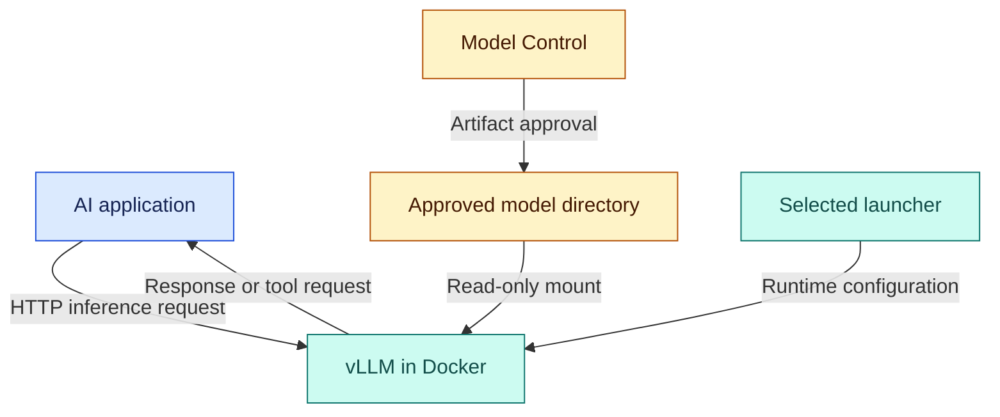

# LLM Inference Service

[](#development-status)
[](Dockerfile)
[](pyproject.toml)
[](uv.lock)

A production-oriented, provider-agnostic service boundary for serving large language models.

The project separates AI applications from the inference engine that happens to run the model.

[Developer runbook](docs/msi-development-runbook.md) · [Qualification report](docs/msi-inference-qualification.md) · [Model checksums](docs/model-reference/SHA256SUMS)

> **Status: local development qualification.** The current reference implementation runs vLLM directly in a controlled Docker configuration. Provider independence is the architectural direction; a completed multi-provider service interface is not claimed. This is not a production-certified deployment.

## Why this exists

Applications should not need domain rewrites whenever the inference backend changes. This project establishes the runtime and qualification foundation for that separation: explicit model identity, locked dependencies, measured configuration choices and documented operational behavior.

The inference layer is responsible for serving. Applications retain business logic, authorization, workflows, tools and user experience. Model Control determines which artifacts are permitted to enter the serving environment.

## Start here

| Your goal | Read |
|---|---|
| Build the runtime and start the reference profile | [Developer runbook](docs/msi-development-runbook.md) |
| Understand why the 12K fixed-cache profile was selected | [Qualification report](docs/msi-inference-qualification.md) |
| Verify the recorded model files | [SHA256SUMS](docs/model-reference/SHA256SUMS), using the runbook's verification steps |
| Understand current implementation limits | [Development status](#development-status) and [Security boundary](#security-boundary) |

For a new checkout, run in **Bash on Linux or WSL2**:

```bash
git clone https://github.com/NiiOsa1/llm-inference-service.git
cd llm-inference-service
```

Then follow the runbook in order: prerequisites, source revision, image build, model acquisition and verification, GPU access, launcher configuration, readiness and response checks.

The launcher currently contains a local image ID and model path. Adapt those values as documented before launching on another machine. A clone does not include model weights, a built Docker image or the complete historical benchmark evidence.

## Architecture

The current request path and artifact supply are separate:



Model Control approval is recorded before serving. The current launcher checks directory existence; it does not enforce the approval decision or verify checksums automatically.

The intended service boundary will let applications call a stable provider interface while qualified adapters select the inference implementation. vLLM is the first backend. Future self-hosted and managed-provider adapters remain planned work; matching API shapes alone does not establish equivalent behavior.

| Boundary | Responsibility |
|---|---|
| Model Control | Artifact acquisition, provenance, integrity checks and admission decisions |
| LLM Inference Service | Runtime configuration, inference delivery and the evolving provider boundary |
| Applications | Domain logic, user authorization, conversation state, approved tool execution and presentation |

## Qualified reference profile

The following configuration was validated for local development on the reference MSI system on **2026-10-03**. Other environments require their own qualification.

| Component | Recorded selection |
|---|---|
| Host | MSI Titan 18 HX, RTX 5090 Laptop GPU with approximately 24 GiB VRAM, Windows / WSL2 Ubuntu 24.04 |
| Runtime | vLLM 0.30.0, Python 3.12.3, CUDA 13.2.1 container base |
| Recorded model repository | `nvidia/Qwen3.8-27B-NVFP4` |
| Recorded model revision | `482ca0f3832238542f8f5295dde86b5f22711d80` |
| Context budget | 12,288 tokens, including input and output |
| Attention KV cache | Fixed 805,306,368 bytes (768 MiB), FP8 |
| Execution | Decode CUDA Graph replay enabled; model compilation disabled |
| Scheduling | One active sequence; text-only profile |
| Endpoint | `http://127.0.0.1:8000/v1/chat/completions` |
| Launcher | [`scripts/start-graphs-12k-fixed-cache.sh`](scripts/start-graphs-12k-fixed-cache.sh) |

The model identity above comes from the local Model Control record. It is distinct from the serving alias `qwen3.8-27b-nvfp4`. Full hardware, driver, image identity and argument details are in the qualification report.

### Evidence behind the selection

- The selected fixed-cache profile passed three saved near-limit requests and two container restart checks, each followed by a correct near-limit response.
- In an earlier matched-12K streaming comparison, repeat runs averaged **1.567 s with graphs versus 4.605 s eager** for the same 46 output tokens. Those timing measurements preceded fixed-cache selection and are not general throughput claims.
- Eager at 25,088 tokens remains a historical capacity reference. It is not the daily default, and its experimental launcher has been archived outside the current `scripts/` directory.

See the report for inputs, output-length differences, failures, cache behavior and measurement limitations. No new broad tuning sweep is needed merely to reproduce this documentation checkpoint.

## Reproducibility

| Input | Where it is recorded |
|---|---|
| CUDA base, uv image digests and Python version | [Dockerfile](Dockerfile) |
| Direct dependencies and package indexes | [pyproject.toml](pyproject.toml) |
| Resolved Python dependencies | [uv.lock](uv.lock) |
| Model identity and acquisition procedure | [Developer runbook](docs/msi-development-runbook.md) |
| Expected model-file fingerprints | [SHA256SUMS](docs/model-reference/SHA256SUMS) |
| Runtime flags | [Selected launcher](scripts/start-graphs-12k-fixed-cache.sh) |
| Observations and qualification boundaries | [Qualification report](docs/msi-inference-qualification.md) |

The Docker build uses the lockfile and rejects stale lock data. Backend, model or driver upgrades are engineering changes requiring relevant compatibility and regression checks.

Pinned inputs support reproducibility; they do not guarantee byte-identical rebuilt images, identical generated output or identical timing. A clean-machine execution of the updated runbook remains unverified. Later benchmark records are locally backed up but not yet published, so a clone alone cannot reproduce the complete historical test suite.

## Development status

| Area | Evidence / remaining work |
|---|---|
| Runtime packaging | Dockerfile, dependency declarations and lockfile committed; original container exercised |
| Selected GPU profile | Fixed-cache 12K profile validated on the reference system, including two container restarts |
| Model provenance | Full recorded revision and checksum reference documented; automatic launch-time admission enforcement pending |
| Basic readiness and responses | Exercised in qualification; runbook provides checks |
| Streaming and tool requests | Exercised on the earlier graph profile; focused regression after fixed-cache selection remains open |
| Provider abstraction | Architectural goal; multi-provider implementation and behavior qualification not established |
| Observability | Runtime logs available; production metrics, tracing and operational telemetry remain open |
| Timeouts, cancellation and queues | Service-level policies and validation remain open |
| Deployment resilience | Soak tests, host-reboot/GPU-reset recovery and remote deployment controls remain open |
| Evidence distribution | Documentation published in stages; complete reviewed benchmark replay bundle pending |

## Security boundary

The intended policy is approved-model-only serving with least privilege. The current reference launcher mounts a selected model directory read-only, enables Hugging Face offline mode and binds the published API port to host loopback.

These are limited controls. Offline mode is not network isolation, and a read-only mount does not establish artifact trust. The launcher does not currently inspect the approval record or automatically validate the checksum list. Follow the runbook's integrity checks before serving.

Model-generated tool requests are data for the application to validate and authorize. Inference does not grant permission to execute tools or access application data.

The serving environment should receive only the access needed to read approved artifacts, use allocated compute, expose its configured endpoint and emit permitted telemetry. It should not receive unrestricted application-database, telecom-data, user-file or infrastructure access.

Remote authentication, transport protection, rate limits and deployment policies require separate implementation and validation before exposing the service beyond the local development boundary. Loopback binding is not a substitute for those controls.

## Engineering requirements

These requirements guide implementation; they are not a claim that every control is delivered:

- Stable provider contracts with explicit capability and error behavior.
- Reproducible build inputs and explicit model identity.
- Enforced artifact admission and least-privilege deployment.
- Health/readiness checks, structured telemetry and traceable failures.
- Bounded work, explicit timeouts, cancellation and backpressure.
- Predictable startup, shutdown and recovery behavior.
- Regression and performance qualification for consequential changes.
- No application business logic in the inference layer.

## Repository safety

This repository is public. Do not commit model weights, credentials, tokens, private keys or certificates, proprietary datasets, telecom/customer data, private application prompts or production secret files.

Supply runtime artifacts and secrets separately through controlled configuration. Review logs and container inspection output before publication because they can contain environment values, paths and request data. Use synthetic data for public examples and benchmarks.

## Relationship to Transmission AI

Transmission AI is a separate private application and telecom-domain system. It consumes inference while retaining its own data, workflows, authorization and tool execution. This repository is intended to remain reusable outside telecom.

Conversation persistence, end-user interfaces, business logic, artifact trust decisions and unrestricted tool execution are outside this service's scope.

## Contributing engineering changes

Explain the problem, intended behavior and validation evidence with each change. For runtime changes, record the source commit, image identity, model revision, hardware/driver environment and affected configuration. Separate measured observations from expectations, and include failure cases where relevant.

Use synthetic examples. Do not publish secrets or private operational data in an issue, patch or log. The runbook and qualification report define the current reference; extending their claims requires additional evidence.

## Engineering philosophy

Reduce feature breadth when necessary, not engineering quality.

The goal is a small service with a permanent architecture that can be hardened, extended, benchmarked, containerized, and deployed without requiring an architectural rewrite.
